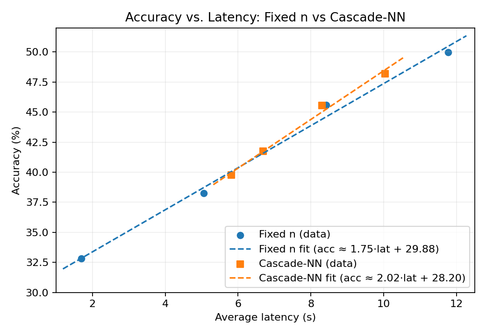

# CASC-lite GSM8K Entropy Cascade Report

## Experimental Setup
- **Model / Backend:** Meta-Llama-3-8B-Instruct (HF Transformers, CUDA)
- **Dataset:** GSM8K full split (8,792 problems)
- **Reference run:** Fixed `n=7` sweep with per-sample latencies, token counts, and prefix entropy for up to 50 tokens
- **Post-hoc labels:** Majority vote outcomes for `n={1,3,5,7}` derived from the same completions
- **Feature design:** 32-token entropy vector; stage-wise models additionally use previous stage probabilities and vote agreement flags
- **Learner:** Scikit-learn logistic regression (`lbfgs`, `C=1.0`, `max_iter=1000`) trained per stage with 5-fold stratified OOF predictions

## Baseline & Entropy Threshold Strategies
| Strategy | Accuracy | Avg n | Avg latency (s) | Avg tokens |
| --- | --- | --- | --- | --- |
| Fixed n=1 | 32.83% | 1.00 | 1.69 | 100.27 |
| Fixed n=3 | 38.24% | 3.00 | 5.06 | 100.49 |
| Fixed n=5 | 45.60% | 5.00 | 8.42 | 100.28 |
| Fixed n=7 | 49.97% | 7.00 | 11.77 | 100.13 |
| K=8 High-Accuracy | 46.80% | 5.80 | 9.90 | 100.16 |
| K=16 High-Accuracy | 47.32% | 5.80 | 9.92 | 99.97 |
| K=32 High-Accuracy | 46.77% | 5.80 | 9.82 | 100.02 |
| K=8 Balanced | 41.94% | 4.00 | 6.84 | 100.26 |
| K=16 Balanced | 42.41% | 4.00 | 6.89 | 100.37 |
| K=32 Balanced | 41.25% | 4.00 | 6.83 | 100.30 |

## Entropy-NN (Single-stage) Policies
- Logistic regression on 32-token entropy feature; thresholds on `p(n=3)` / `p(n=5)` control escalation.
- Representative operating points:
  - **Avg n ≤ 6:** 47.36% accuracy, (p₃ ≥ 0.65, p₅ ≥ 0.45), n-share = 0.5% / 55.1% / 44.5% for n=3/5/7
  - **Avg n ≤ 5:** 44.68%, (0.50, 0.30), n-share = 18.0% / 69.0% / 13.0%
  - **Avg n ≤ 4:** 40.83%, (0.30, 0.40), n-share = 74.8% / 0.6% / 24.6%

## Cascade-NN Policies (Stage-wise Gating)
| Strategy | Accuracy | Avg n | Avg latency (s) | Avg tokens | Thresholds (t₁, t₃, t₅) | n-share (n1/n3/n5/n7) |
| --- | --- | --- | --- | --- | --- | --- |
| Cascade-NN (avg n ≤ 6) | 48.18% | 5.97 | 10.03 | 100.05 | (0.60, 0.55, 0.50) | 0% / 8% / 34% / 57% |
| Cascade-NN (avg n ≤ 5) | 45.54% | 4.94 | 8.30 | 100.22 | (0.70, 0.50, 0.30) | 0% / 15% / 72% / 12% |
| Cascade-NN (avg n ≤ 4) | 41.73% | 3.99 | 6.69 | 100.30 | (0.40, 0.45, 0.30) | 27% / 8% / 53% / 12% |
| Cascade-NN (avg n ≤ 3.5) | 39.76% | 3.50 | 5.82 | 100.32 | (0.35, 0.45, 0.35) | 45% / 4% / 32% / 19% |

**仕組みの概要**

1. **Stage1 (n=1判定)** : 32トークン分のエントロピー系列から「n=1で正解できる確率」を推定。Probability が高ければそこで停止しコストを最小化します。
2. **Stage2 (n=3判定)** : n=1 をスキップした問題だけ n=3 まで生成。入力にはエントロピー系列に加えて Stage1 の確率と「n=1 と n=3 の予測が一致したか」を付与します。Stage2 の確率が閾値を超えれば n=3 で打ち切り。
3. **Stage3 (n=5判定)** : Stage2 で危険と判断された問題のみ n=5 まで生成。Stage1/2 の確率や n1/n3/n5 の一致フラグを入力に追加。ここで十分な確度が得られれば n=5 で終了。
4. **Stage4 (n=7判定)** : Stage3 でも危ない案件だけ n=7 まで増票。Stage1～3 の確率と一致フラグ一式を使い「n=7 で正解できるか」判定します。

各段階はスキップ/エスカレーションを少数の閾値で制御できるため、平均サンプル数と精度のトレードオフを柔軟に調整できます。

**Stage model metrics** (train set):
- Stage1 (n=1): accuracy 0.670, AUC 0.742
- Stage2 (n=3): accuracy 0.646, AUC 0.708
- Stage3 (n=5): accuracy 0.620, AUC 0.685
- Stage4 (n=7): accuracy 0.625, AUC 0.691

## Accuracy vs. Latency Trend

Linear fits (accuracy %, latency in seconds):
- **Fixed n:** acc ≈ 1.75 × latency + 29.88
- **Cascade-NN:** acc ≈ 2.02 × latency + 28.20

## Key Takeaways
1. 固定 n=7 が最高精度 (49.97%)。カスケードは平均 n を 6 以下に抑えつつ 48.18% まで維持可能。
2. 平均 n≈5 では固定 n=5 と Cascade-NN(≤5) が同等コスト・精度 (~45.5%)。既存の K=16 Balanced (42.4%) を上回る。
3. 高効率 (平均 n≈2) は従来のエントロピー閾値 (K=16 High-Efficiency) が引き続き優勢。
4. 32 トークンのエントロピー系列だけでも段階的判別は成立するが、精度向上には vote 分布や平均対数尤度など追加特徴が有望。

## Reproduction Notes
- Activate environment: `source .venv/bin/activate`
- Train cascade models: `python scripts/train_entropy_cascade.py --examples_csv results/.../20251029_040055_fixed_examples.csv --output_dir models/entropy_cascade`
- Evaluate thresholds: `python scripts/eval_entropy_cascade.py --examples_csv ... --model_dir models/entropy_cascade`
